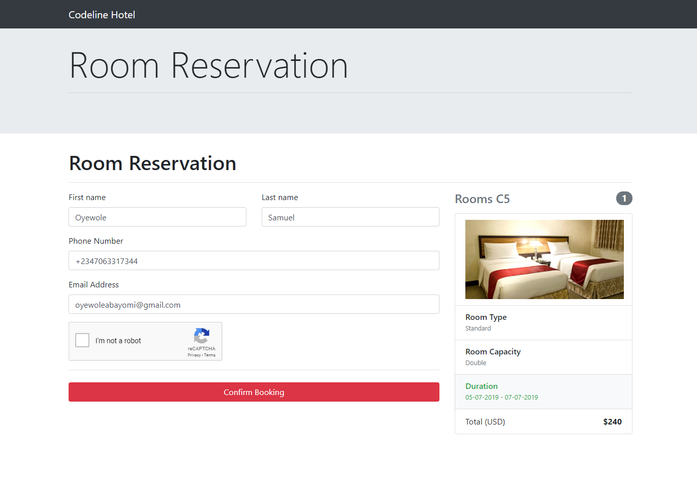

# Wordpress plugin
This plugin pull list of hotels from HOTEL api and display it in wordpress home page

## Booking
<div align="center">
    
</div>

## Installation for codeline hotel plugin
1. Use git clone into wordpress plugin directory
2. Go to your wordpress, login and click on Plugin menu
3. You'll see "Codeline Plugin", click on "Activate"
4. Next(), go to ```http://localhost/wordpress/rooms?rooms```
5. wow, search and see the room result, please ensure you're running CHML app using ```php artisan serve```

## Have any issue?
I'm available on Skype to help out, kindly chat me up oyewoleabayomi@gmail.com